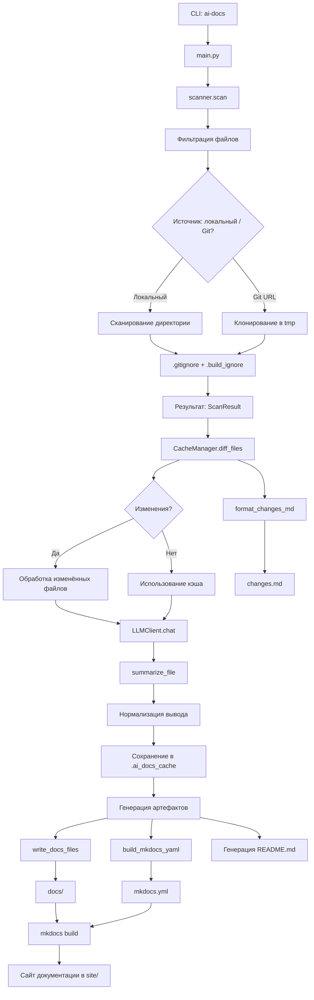

# Архитектура



## Архитектура

### Основные компоненты

**CLI-интерфейс**  
Точка входа — `ai_docs/cli.py`. Обрабатывает аргументы командной строки, инициализирует настройки из переменных окружения и `.env`, передаёт параметры в `main.py`.

**Сканирование файлов**  
Модуль `scanner` рекурсивно обходит файловую систему:
- Поддерживает локальные пути и Git-репозитории (клонируются во временные директории).
- Применяет фильтры: `.gitignore`, `.build_ignore`, `DEFAULT_EXCLUDE_PATTERNS`, `FIXED_INCLUDE_PATTERNS`.
- Определяет тип файла (код, конфигурация, документация) и домены (Kubernetes, Terraform и др.) по расширениям и именам.
- Ограничивает размер файлов (`max_size`, по умолчанию 200 КБ).
- Результат — объект `ScanResult` с метаданными.

**Кэширование**  
`CacheManager` управляет двумя файлами в `.ai_docs_cache/`:
- `index.json` — хранит хэши файлов (SHA-256), пути и метаданные.
- `llm_cache.json` — кэш ответов LLM (ключ — хеш payload).
Метод `diff_files` возвращает дельту: `added`, `modified`, `deleted`, `unchanged`. Это позволяет перегенерировать только изменённые разделы.

**LLM-клиент**  
`LLMClient` отправляет запросы к OpenAI-совместимому API:
- Инициализируется через `from_env` (читает `OPENAI_API_KEY`, `OPENAI_BASE_URL`, `OPENAI_MODEL`).
- Поддерживает кэширование, потокобезопасность (через `threading.Lock`), таймауты (120/480 сек).
- Автоматически формирует URL: `{base_url}/v1/chat/completions`.
- Параметры: `temperature=0.2`, `max_tokens=1200`, `context_limit=8192`.

**Генерация резюме**  
`summarize_file`:
- Выбирает промпт в зависимости от типа файла (`SUMMARY_PROMPT`, `MODULE_SUMMARY_PROMPT`, `CONFIG_SUMMARY_PROMPT`).
- Разбивает текст на чанки через `chunk_text` (с учётом `tiktoken` и лимита токенов).
- Отправляет запрос LLM, нормализует вывод (`_normalize_module_summary`, `_format_config_blocks`).
- Результат сохраняется в `.ai_docs_cache/summaries/`.

**Построение документации**  
- `build_mkdocs_yaml` формирует `mkdocs.yml` с динамической навигацией (через `_build_tree_nav`).
- `write_docs_files` записывает Markdown-файлы в `docs/`.
- Поддерживается локальный режим: `AI_DOCS_LOCAL_SITE` → `site_url: null`, `use_directory_urls: false`.

**Генерация артефактов**  
На выходе создаются:
- `README.md` — краткое описание проекта, архитектура, зависимости.
- `docs/` — полная документация (MkDocs): модули, конфиги, тесты, глоссарий.
- `changes.md` — отчёт об изменениях (новые/изменённые файлы, перегенерированные разделы).
- `_index.json` — навигационный индекс с приоритетами модулей.

### Поток данных

1. CLI запускает `main.py` с параметрами.
2. `scanner.scan` возвращает список файлов.
3. `CacheManager` определяет, какие файлы нужно обработать.
4. Для каждого файла вызывается `summarize_file` → LLM → кэш.
5. Собирается структура документации: навигация, зависимости, тесты.
6. Генерируются `README.md`, `mkdocs.yml`, `docs/`.
7. Запускается `mkdocs build` (если не `--local-site`).
8. Формируется `changes.md`.

### Особенности реализации

- **Параллелизм**: обработка файлов — в `ThreadPoolExecutor` (количество потоков: `AI_DOCS_THREADS` или флаг `--threads`).
- **Безопасность путей**: все пути нормализуются в POSIX-формат, создаются slug-идентификаторы.
- **Токенизация**: `tiktoken` используется для подсчёта и разбиения текста.
- **Инкрементальность**: при повторном запуске обрабатываются только изменённые файлы.
- **Локализация**: заголовки разделов (`SECTION_TITLES`) и доменов (`DOMAIN_TITLES`) поддерживают языки (по умолчанию `ru`).

### Структура файлов

```
.ai_docs_cache/
├── index.json          # хэши файлов
├── llm_cache.json      # ответы LLM
└── summaries/          # кэш резюме
.ai-docs/
├── _index.json         # навигационный индекс
├── changes.md          # отчёт изменений
├── modules/            # описания модулей
└── configs/            # описания конфигов
docs/                   # вход для MkDocs
mkdocs.yml
README.md
```
