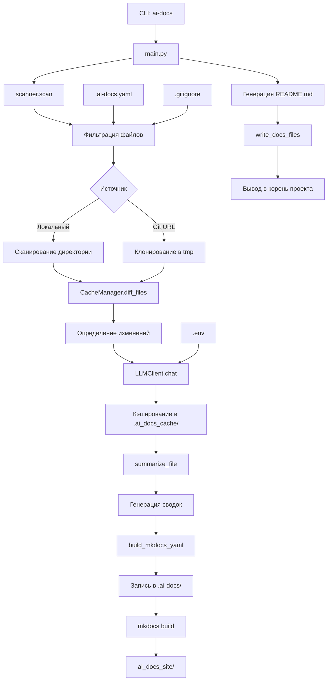

# Архитектура

## Архитектура

### Основные компоненты

**CLI-интерфейс** (`ai_docs/cli.py`)  
Точка входа. Парсит аргументы командной строки, инициализирует настройки, запускает основной процесс. Поддерживает флаги: `--source`, `--readme`, `--mkdocs`, `--threads`, `--no-cache` и др.

**Сканирование файлов** (`ai_docs/scanner.py`)  
Рекурсивно обходит файловую систему. Применяет фильтры:
- Включает: `FIXED_INCLUDE_PATTERNS` (Dockerfile, *.tf, helm.yaml и др.)
- Исключает: `.git`, `node_modules`, `.venv`, `__pycache__`, а также правила из `.gitignore`, `.build_ignore` и `DEFAULT_EXCLUDE_PATTERNS`
- Ограничивает по размеру: `max_size=200000` байт

Поддерживает локальные пути и Git-репозитории (клонируются во временные каталоги).

**Менеджер кэша** (`ai_docs/cache.py`)  
Управляет двумя JSON-файлами в `.ai-docs/`:
- `index.json` — хранит хэши файлов, метаданные, отслеживает изменения (added/modified/deleted)
- `llm_cache.json` — кэширует ответы LLM по SHA256 от payload

Метод `diff_files` определяет, какие файлы нужно перепроцессировать.

**LLM-клиент** (`ai_docs/llm.py`)  
Отправляет запросы к OpenAI-совместимому API. Поддерживает:
- Кэширование через `llm_cache`
- Потокобезопасность (`threading.Lock`)
- Настройки: `model`, `temperature`, `max_tokens`, `context_limit`
- Таймауты: 120s connect, 480s read

Инициализируется через `LLMClient.from_env` на основе переменных окружения.

**Генерация сводок** (`ai_docs/summarize.py`)  
Для каждого файла:
1. Читает содержимое (если текстовый)
2. Разбивает на чанки через `chunk_text` (ограничение по токенам)
3. Отправляет в LLM с соответствующим промптом (`SUMMARY_PROMPT`, `MODULE_SUMMARY_PROMPT` и др.)
4. Нормализует вывод: убирает лишние символы, форматирует конфигурации
5. Сохраняет результат в `.ai-docs/summaries/`

**Построение документации** (`ai_docs/generate.py`)  
Формирует итоговую документацию:
- Генерирует `README.md` — краткий обзор проекта
- Строит `index.md` и `_index.json` — навигационная структура
- Создаёт разделы: архитектура, тесты, зависимости, модули
- Автоматически включает Mermaid-диаграммы при наличии

**Генерация MkDocs** (`ai_docs/mkdocs.py`)  
Формирует `mkdocs.yml`:
- Добавляет навигацию на основе `project_config_nav_paths`, `module_nav_paths`
- Включает поддержку Mermaid через `pymdownx.superfences`
- Настраивает `site_name`, `nav`, `extra_css/js`
- При `--local-site` — корректирует `site_url` и пути

Запускает `mkdocs build -f mkdocs.yml`, вывод в `ai_docs_site/`.

### Потоки данных

1. **Инициализация**: CLI → `main.py` → загрузка `.env`, `.ai-docs.yaml`
2. **Сканирование**: `scanner.scan` → `CacheManager.diff_files` → список файлов для обработки
3. **Обработка**: параллельный вызов `summarize_file` → `LLMClient.chat` → кэширование
4. **Генерация**: сборка `file_map` → `_generate_section` → `write_docs_files`
5. **Сборка**: `build_mkdocs_yaml` → `mkdocs build` → статический сайт

### Ключевые директории

- `.ai-docs/` — промежуточные данные: `index.json`, `llm_cache.json`, `summaries/`, `index.md`
- `.ai_docs_cache/` — кэш LLM-ответов (опционально, если передан)
- `ai_docs_site/` — итоговый сайт после `mkdocs build`

### Интеграции

- **Git**: клонирование репозиториев по URL
- **MkDocs**: генерация сайта, поддержка тем и плагинов
- **OpenAI API**: через `requests`, совместим с кастомными эндпоинтами
- **tiktoken**: подсчёт и разбиение по токенам

Архитектура обеспечивает инкрементальную обработку, многопоточность и повторяемость. Все промежуточные данные сохраняются, что позволяет быстро обновлять документацию при изменениях в коде.
