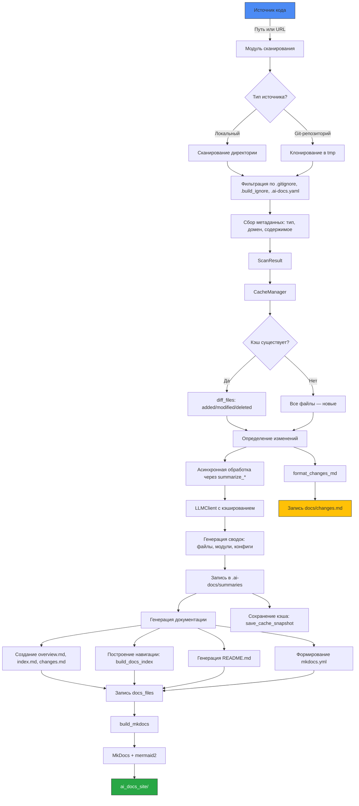

# Архитектура

## Архитектура

`ai_docs` построен как модульная CLI-система для автоматической генерации технической документации на основе статического анализа кода и конфигураций. Архитектура ориентирована на инкрементальность, производительность и повторяемость.

### Основные компоненты

#### 1. **Сканирование (`scanner.py`)**
- Вход: локальный путь или URL Git-репозитория.
- Выход: `ScanResult` — структурированный список файлов с метаданными (путь, тип, домен, первые 4000 символов).
- Применяет фильтрацию:
  - `.gitignore`, `.build_ignore` — через `pathspec`.
  - `.ai-docs.yaml` — пользовательские правила включения/исключения.
  - Встроенные исключения: `.venv`, `node_modules`, `__pycache__`, `.git`.
- Для удалённых репозиториев — временное клонирование.

#### 2. **Управление кэшем (`cache.py`, `CacheManager`)**
- Хранит:
  - `index.json` — хеши файлов, размеры, метаданные.
  - `llm_cache.json` — ответы LLM по хешу запроса.
- Основные операции:
  - `diff_files` — определяет `added`, `modified`, `deleted`, `unchanged`.
  - `carry_unchanged_summaries` — переносит существующие сводки.
  - `cleanup_orphan_summaries` — удаляет устаревшие `.md` в `summaries/`.
- Кэш по умолчанию: `.ai_docs_cache/`.

#### 3. **Генерация сводок (`summarize.py`)**
- Асинхронная обработка с `asyncio.Semaphore` (ограничение по `AI_DOCS_THREADS`).
- Функции:
  - `summarize_changed_file` — для изменённых файлов.
  - `summarize_missing_*` — для новых файлов без сводки.
- Поддержка режимов:
  - `detailed` — полное описание.
  - `config`, `infra`, `module` — специализированные промпты.
- Нормализация формата: исправление Doxygen, Markdown-семантики.

#### 4. **LLM-интерфейс (`llm.py`, `LLMClient`)**
- Асинхронный клиент на `AsyncOpenAI` с поддержкой OpenAI-совместимых API.
- Ключевые функции:
  - `chat` — отправка промпта, возврат текста.
  - `count_tokens` — оценка длины контекста.
  - `chunk_text` — разбиение текста при превышении `max_tokens`.
- Кэширование по `sha256(payload)`.
- Повторные попытки при ошибках 429, 5xx, таймаутах.

#### 5. **Генерация документации (`docs.py`)**
- Формирует структуру в `.ai-docs/`:
  - `overview.md` — общее описание проекта.
  - `index.md` — оглавление с пагинацией (100 элементов).
  - `modules/`, `configs/` — страницы по компонентам.
  - `changes.md` — отчёт об изменениях.
- Использует `build_hierarchical_context` для укладки в лимит токенов.
- Поддержка многоязычности: `language=ru/en`.

#### 6. **Интеграция с MkDocs (`mkdocs.py`)**
- Генерация `mkdocs.yml`:
  - Динамическая навигация: `nav` строится по доменам, модулям, конфигам.
  - Плагины: `search`, `mermaid2`.
  - Расширения: `pymdownx.superfences` для диаграмм.
- Режимы:
  - `local_site=true` — `site_url: ""`, `use_directory_urls: false`.
- Сборка: `mkdocs build -f mkdocs.yml`.

#### 7. **Вспомогательные утилиты**
- `utils.py` — `ensure_dir`, `sha256_text`, `is_binary`, `is_url`.
- `types.py` — `CODE_EXTENSIONS`, `CONFIG_EXTENSIONS`, `detect_domains`.
- `helpers.py` — `collect_dependencies`, `collect_test_info`, `render_testing_section`.

### Поток выполнения

1. **Инициализация**:
   - Чтение `--source`, `--language`, `--regen`.
   - Загрузка `OPENAI_API_KEY`, `AI_DOCS_THREADS`.

2. **Сканирование**:
   - `scan_source` → `ScanResult`.

3. **Кэширование**:
   - `init_cache` → `file_map` → `diff_files`.

4. **Генерация сводок**:
   - Асинхронный вызов `summarize_*` для новых/изменённых файлов.
   - Запись в `summaries/`, `modules/`, `configs/`.

5. **Построение документации**:
   - Формирование `docs_files`.
   - Генерация `README.md`.
   - Создание `mkdocs.yml`.

6. **Финализация**:
   - Запись файлов в `.ai-docs/`.
   - Сборка сайта: `build_mkdocs`.
   - Логирование изменений: `format_changes_md` → `docs/changes.md`.
   - Сохранение кэша: `save_cache_snapshot`.

### Особенности реализации

- **Инкрементальность**: перегенерируются только изменённые/новые файлы.
- **Параллелизм**: `AI_DOCS_THREADS` управляет числом одновременных LLM-запросов.
- **Безопасность**: бинарные файлы не читаются, большие файлы (>200 КБ) пропускаются.
- **Поддержка диаграмм**: Mermaid.js внедряется в HTML через `_postprocess_mermaid_html`.
- **Очистка**: удаление устаревших `.md` в `modules/`, `configs/` при реорганизации.

Архитектура позволяет интегрировать `ai_docs` в CI/CD, обеспечивая актуальную документацию без ручного вмешательства.
