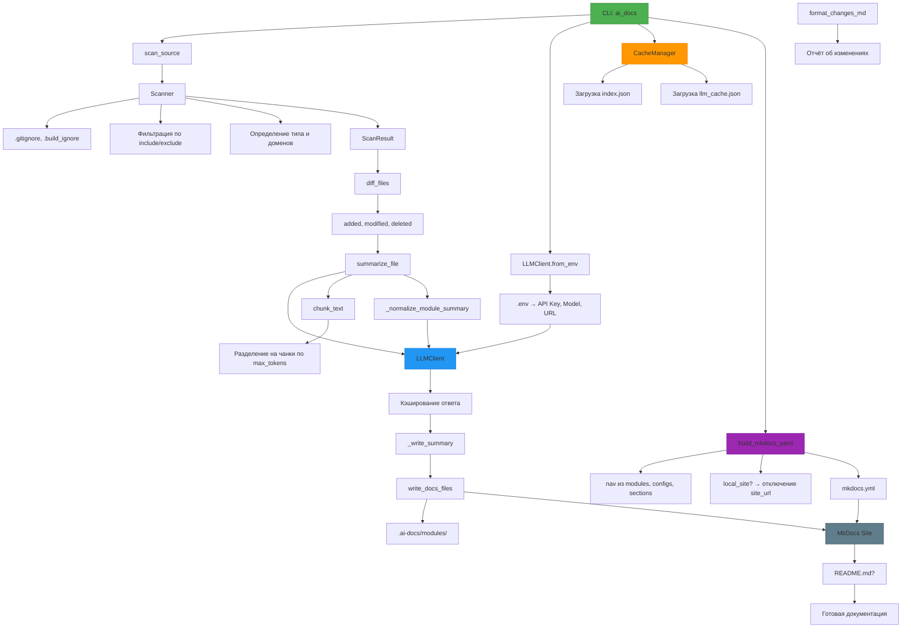

# Архитектура

## Архитектура

Система `ai_docs` построена по модульному принципу, где каждый компонент отвечает за определённый этап генерации технической документации. Вся обработка проходит через последовательный и параллельный поток данных, начиная со сканирования исходников и заканчивая публикацией документации.

### Основные компоненты

#### 1. **CLI-интерфейс (`ai_docs/cli.py`)**
Единая точка входа. Принимает аргументы командной строки:
- `--source`: путь или URL репозитория.
- `--output`, `--language`, `--threads`, `--cache-dir` и др.
Инициирует сканирование, загружает конфигурацию, запускает генерацию.

#### 2. **Сканер (`ai_docs/scanner.py`)**
Рекурсивно обходит директорию или клонирует Git-репозиторий. Фильтрует файлы:
- По расширениям (включая `DEFAULT_INCLUDE_PATTERNS`).
- По размеру (`max_size`, по умолчанию 200 КБ).
- По правилам `.gitignore`, `.build_ignore`.
Определяет тип файла (`code`, `infra`) и домены (`kubernetes`, `docker`) через эвристики.

#### 3. **LLM-клиент (`ai_docs/llm.py`)**
Интерфейс к LLM (OpenAI или совместимый). Ключевые особенности:
- Инициализация из `.env` через `from_env()`.
- Поддержка кэширования по SHA-256 хешу нормализованного запроса.
- Потокобезопасный доступ к кэшу через `threading.Lock`.
- Таймауты: 120 с (подключение), 480 с (ответ).

#### 4. **Кэш-менеджер (`ai_docs/cache.py`)**
Управляет двумя типами кэша:
- `index.json`: хранит хеши файлов для определения изменений.
- `llm_cache.json`: кэширует ответы LLM по строковым ключам.
Метод `diff_files()` возвращает `added`, `modified`, `deleted`, `unchanged` — позволяет обрабатывать только изменённые файлы.

#### 5. **Генератор документации (`ai_docs/generator.py`)**
Основная логика:
- `summarize_file()`: генерирует описание файла, разбивая текст на чанки (`chunk_text`) при превышении `max_tokens`.
- Поддержка `detailed=True` для Doxygen-подобной документации.
- `_normalize_module_summary()`: переформатирует текст в строгий Markdown при необходимости.
- Результат сохраняется в `.ai-docs/modules/` через `_write_summary()`.

#### 6. **Генератор MkDocs (`ai_docs/mkdocs.py`)**
Формирует `mkdocs.yml`:
- Динамическая навигация (`nav`) по модулям, конфигам и разделам.
- Поддержка локального режима (`local_site=True` → `site_url: null`).
- Активные плагины: `search`, `mermaid2`.
- Расширения Markdown: `pymdownx.*`, `admonition`.
Файлы документации записываются через `write_docs_files()`.

#### 7. **Токенизация (`ai_docs/tokenizer.py`)**
Использует `tiktoken` для:
- `count_tokens()`: подсчёт токенов по модели.
- `chunk_text()`: разбиение текста на фрагменты с учётом `context_limit`.

#### 8. **Утилиты (`ai_docs/utils.py`)**
Вспомогательные функции:
- `sha256_text()`, `read_text_file()` — работа с хешами и файлами.
- `is_binary_file()` — проверка по наличию `\x00` в первых 2048 байтах.
- `safe_slug()` — преобразование имён файлов в безопасные имена.

#### 9. **Классификация (`ai_docs/types.py`)**
Определяет:
- Тип файла: `code`, `config`, `infra` — по расширениям и именам.
- Домены: `kubernetes`, `terraform` — по именам файлов (`Dockerfile`, `values.yaml`) и контенту (`apiVersion: apps/v1`).
- `is_infra()` — флаг для инфраструктурных компонентов.

#### 10. **Отчёт об изменениях (`ai_docs/changes.py`)**
`format_changes_md()` формирует итоговый Markdown-отчёт:
- Секции: «Добавленные», «Изменённые», «Удалённые файлы».
- Список перегенерированных разделов.
- Краткое резюме.

### Поток данных

1. **Инициализация**: CLI → загрузка `.env` → `LLMClient`.
2. **Сканирование**: `scan_source()` → `ScanResult` с метаданными.
3. **Сравнение с кэшом**: `diff_files()` → определение изменённых файлов.
4. **Генерация**: параллельный вызов `summarize_file()` через `ThreadPoolExecutor`.
5. **Постобработка**: нормализация, сохранение в `.ai-docs/`.
6. **Финализация**: `build_mkdocs_yaml()` → `mkdocs.yml`, `README.md` (опционально).
7. **Вывод**: сайт MkDocs в `ai_docs_site/`.

### Особенности реализации

- **Параллелизм**: управление через `AI_DOCS_THREADS` и `--threads`.
- **Безопасность**: временные репозитории удаляются после ошибок.
- **Локализация**: `SECTION_TITLES`, `DOMAIN_TITLES` — поддержка `ru`, `en`.
- **Интеграция**: скил `documentary` использует `.ai-docs/_index.json` как источник истины.

Архитектура обеспечивает повторяемость, производительность и гибкость при интеграции в CI/CD и локальную разработку.
