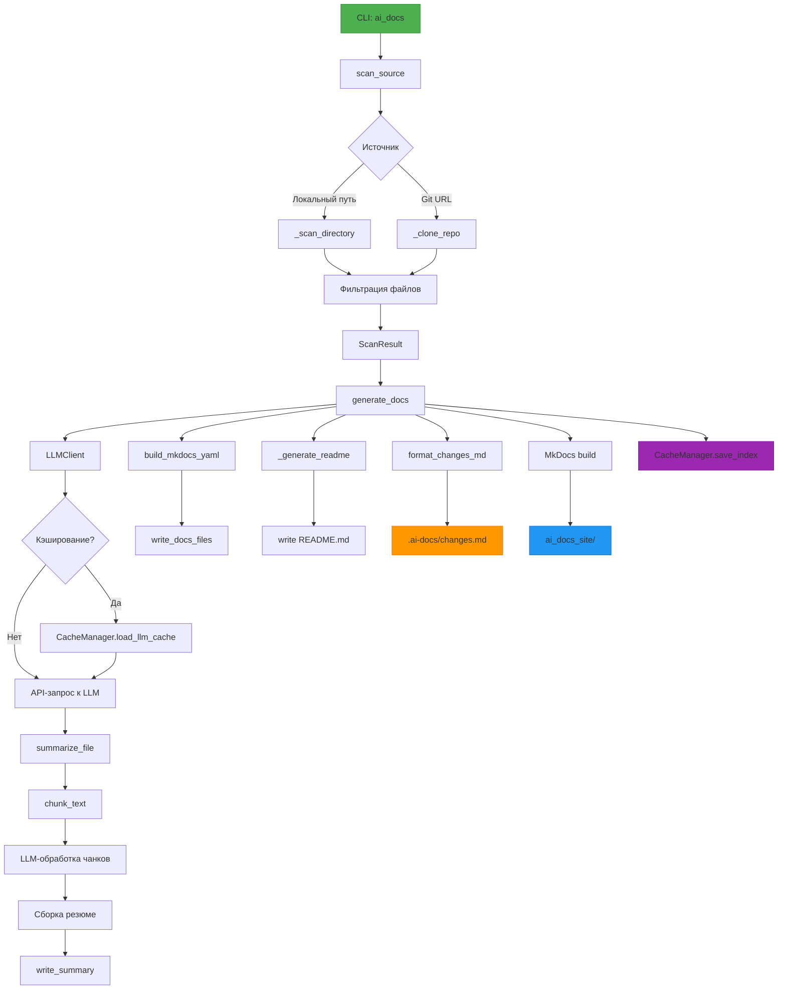

# Архитектура

## Архитектура

`ai_docs` — модульная CLI-система для автоматической генерации технической документации на основе анализа исходного кода. Архитектура построена вокруг сканирования, LLM-обработки и генерации структурированных выходных артефактов.

### Основные компоненты

#### 1. **CLI-интерфейс (`ai_docs/__main__.py`, `ai_docs/cli.py`)**
Точка входа. Парсит аргументы командной строки, инициализирует конфигурацию и запускает основной цикл генерации. Поддерживает:
- `--source`: локальный путь или Git URL.
- `--readme` / `--mkdocs`: выбор типа вывода.
- `--language`: локализация (`ru`/`en`).
- `--threads`: параллельная обработка.
- `--cache-dir`, `--no-cache`: управление кэшированием.

#### 2. **Сканер (`ai_docs/scanner.py`)**
Рекурсивно обходит файлы, применяя фильтрацию:
- Учитывает `.gitignore` и встроенные исключения (`.git`, `node_modules`, `.venv`).
- Пропускает бинарные файлы (`is_binary_file`).
- Ограничивает размер файлов (`--max-size`, по умолчанию 200 КБ).
- Классифицирует файлы: `code`, `config`, `docs`, `infra` и др. (`classify_type`, `detect_domains`).
- Возвращает `ScanResult` с отфильтрованным списком файлов.

#### 3. **LLM-клиент (`ai_docs/llm.py`)**
Интерфейс к языковой модели:
- Инициализируется из `.env` (`OPENAI_API_KEY`, `OPENAI_MODEL` и др.).
- Поддерживает кэширование через `LLMClient.chat(cache=llm_cache)`.
- Ключ кэша — SHA-256 от нормализованного JSON-запроса.
- Использует `requests` с таймаутами (30с/120с) и обработкой ошибок.

#### 4. **Генератор документации (`ai_docs/docs.py`)**
Основной модуль генерации:
- Параллельно суммирует файлы через `summarize_file` (с чанкингом по `max_tokens`).
- Генерирует разделы: "Архитектура", "Зависимости", "CI/CD" и др.
- Поддерживает Mermaid-диаграммы в разделах (через `pymdownx.superfences`).
- Формирует `README.md` и структуру документации для MkDocs.

#### 5. **Кэш и индексация (`ai_docs/cache.py`)**
Обеспечивает инкрементальность:
- `CacheManager` хранит:
  - `index.json`: хэши файлов и метаданные секций.
  - `llm_cache.json`: закэшированные ответы LLM.
- `diff_files()` определяет `added`/`modified`/`deleted` файлы.
- Ускоряет повторные запуски — перегенерируются только изменённые элементы.

#### 6. **Генерация MkDocs (`ai_docs/config.py`)**
Формирует выходную структуру:
- `build_mkdocs_yaml()` создаёт `mkdocs.yml` с:
  - Локализованными заголовками (`SECTION_TITLES`).
  - Навигацией по доменам (`kubernetes`, `terraform` и др.).
  - Поддержкой `--local-site` (пустой `site_url`, `use_directory_urls: false`).
- `write_docs_files()` размещает `.md`-файлы в `docs/`.

#### 7. **Вспомогательные модули**
- `ai_docs/utils.py`: `sha256_text`, `safe_slug`, `is_binary_file`, `to_posix`.
- `ai_docs/tokenizer.py`: `chunk_text()` через `tiktoken`, с учётом `max_tokens`.
- `ai_docs/changes.py`: `format_changes_md()` — отчёт об изменениях в Markdown.

### Поток данных

1. **Сканирование**: `scan_source()` → `ScanResult` (с учётом `.gitignore`, `--include`/`--exclude`).
2. **Сравнение с кэшем**: `CacheManager.diff_files()` → определение изменённых файлов.
3. **Суммаризация**: `summarize_file()` → чанки → LLM → резюме → `.ai-docs/summaries/`.
4. **Генерация**: `_generate_section()` → Markdown-файлы → `write_docs_files()`.
5. **Конфигурация**: `build_mkdocs_yaml()` → `mkdocs.yml`.
6. **Сборка**: вызов `mkdocs build` → `ai_docs_site/`.
7. **Отчёт**: `format_changes_md()` → `.ai-docs/changes.md`.
8. **Сохранение кэша**: `CacheManager.save_index()`.

### Особенности реализации

- **Параллелизм**: `ThreadPoolExecutor` с числом потоков из `--threads` или `AI_DOCS_THREADS`.
- **Безопасность**: `safe_slug()` для имён файлов, `ensure_dir()` для создания путей.
- **Отказоустойчивость**: временные репозитории удаляются при ошибках, `errors="ignore"` при чтении UTF-8.
- **Локализация**: все заголовки параметризованы через `language`.

Архитектура обеспечивает быструю, повторяемую и масштабируемую генерацию документации с минимальным вмешательством пользователя.
