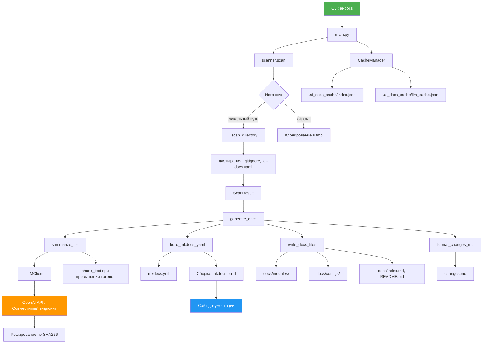

# Архитектура

# Архитектура

Архитектура `ai_docs` построена вокруг модульного CLI-инструмента, автоматизирующего анализ кода и генерацию документации с использованием LLM. Основные компоненты взаимодействуют последовательно, с поддержкой кэширования и инкрементальной обработки.

## Основные компоненты

### 1. CLI-интерфейс (`ai_docs/cli.py`)
Точка входа. Парсит аргументы командной строки, инициализирует настройки из переменных окружения и `.env`, передаёт управление в `main.py`. Поддерживает флаги:
- `--source` — обязательный путь или URL.
- `--readme`, `--mkdocs` — выбор формата вывода.
- `--no-cache` — отключение кэширования.
- `--threads` — управление параллелизмом.

### 2. Сканирование файлов (`scanner.py`)
Рекурсивно обходит файловую систему или клонирует Git-репозиторий. Применяет фильтрацию:
- Включает файлы по расширениям из `CODE_EXTENSIONS`, `CONFIG_EXTENSIONS`, `FIXED_INCLUDE_PATTERNS`.
- Исключает по `DEFAULT_EXCLUDE_PATTERNS`, `.gitignore`, `.build_ignore` и пользовательским правилам из `.ai-docs.yaml`.
- Ограничивает размер файлов (`max_size=200KB` по умолчанию).
- Определяет тип файла и домены (Kubernetes, Terraform и др.) через `classify_type` и `detect_domains`.

Результат — объект `ScanResult` с метаданными по каждому файлу.

### 3. Кэширование (`cache.py`)
`CacheManager` управляет двумя JSON-файлами:
- `index.json` — хранит хэши файлов (SHA-256) и метаданные для определения изменений.
- `llm_cache.json` — кэш ответов LLM, ключ — хеш сериализованного payload.

Метод `diff_files` возвращает:
- `added`, `modified`, `deleted`, `unchanged` — для инкрементальной генерации.

Кэш LLM потокобезопасен (использует `threading.Lock`).

### 4. Генерация резюме (`summary.py`)
Для каждого файла:
- Читает содержимое (если не бинарный).
- При превышении лимита токенов — разбивает на чанки через `chunk_text`.
- Формирует промпт в зависимости от типа: `SUMMARY_PROMPT`, `MODULE_SUMMARY_PROMPT`, `CONFIG_SUMMARY_PROMPT`.
- Отправляет запрос в `LLMClient`.
- Нормализует вывод: `_normalize_module_summary`, `_format_config_blocks`.

Результат сохраняется в `.ai-docs/summaries/` как Markdown.

### 5. LLM-клиент (`llm.py`)
`LLMClient` отправляет запросы к OpenAI-совместимому API:
- Инициализируется через `from_env` с переменными `OPENAI_API_KEY`, `OPENAI_BASE_URL`, `OPENAI_MODEL`.
- Поддерживает кастомные параметры: `temperature`, `max_tokens`, `context_limit`.
- Автоформирует URL: `base_url + /v1/chat/completions`.
- Кэширует ответы по хешу payload.

Таймауты: 120 сек (connect), 480 сек (read).

### 6. Построение документации (`mkdocs.py`)
Формирует структуру:
- `build_mkdocs_yaml` — генерирует `mkdocs.yml` с поддержкой:
  - Локализованных заголовков.
  - Плагинов: `search`, `mermaid2`.
  - Расширений Markdown: `pymdownx.superfences` (Mermaid).
  - Иерархической навигации через `_build_tree_nav`.
- `write_docs_files` — записывает Markdown-файлы в `docs/`, воссоздавая структуру модулей и конфигов.

При `AI_DOCS_LOCAL_SITE` — отключает `site_url` и `use_directory_urls`.

### 7. Генерация финальных артефактов (`main.py`)
Объединяет все данные:
- Формирует `README.md` на основе шаблонов.
- Генерирует `changes.md` через `format_changes_md` с указанием:
  - Добавленных/изменённых/удалённых файлов.
  - Перегенерированных разделов.
- Запускает `mkdocs build -f mkdocs.yml` (если `--mkdocs`).

## Поток выполнения
1. CLI → `main.py` → `scan_source`.
2. Сканирование → `ScanResult`.
3. `CacheManager.diff_files` → определение изменений.
4. Для новых/изменённых файлов: `summarize_file` → `LLMClient`.
5. Построение `mkdocs.yml` и запись файлов.
6. Генерация `README.md`, `changes.md`.
7. Сборка сайта.

## Особенности
- **Параллелизм**: обработка файлов в `threads` (по умолчанию — `os.cpu_count()`).
- **Безопасность путей**: нормализация в POSIX, slug-преобразование.
- **Поддержка локализации**: `SECTION_TITLES`, `DOMAIN_TITLES` (настраивается).
- **Очистка**: удаление устаревших файлов в `docs/` перед записью.

Архитектура обеспечивает масштабируемость, повторяемость и минимальное время перегенерации за счёт кэширования и инкрементального анализа.
