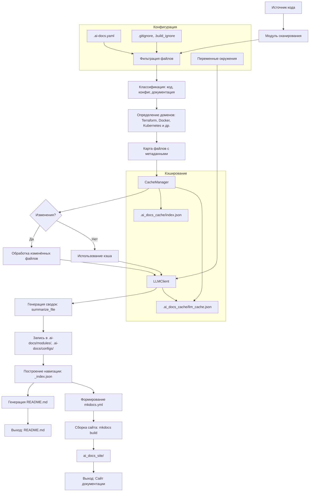

# Архитектура

## Архитектура

Архитектура `ai_docs` построена вокруг модульной обработки исходных файлов с последующей генерацией структурированной технической документации. Система разделяет анализ, кэширование, генерацию и публикацию, обеспечивая высокую производительность и повторяемость.

### Основные компоненты

#### 1. **Сканирование и фильтрация**
- `scanner.scan()` рекурсивно обходит директорию или клонированный репозиторий.
- Применяются правила из `.gitignore`, `.build_ignore`, `.ai-docs.yaml` и встроенные шаблоны (`DEFAULT_EXCLUDE_PATTERNS`).
- Файлы классифицируются по типу: код, конфигурация, документация — на основе расширений и имён.
- Определяются домены (например, `kubernetes`, `terraform`) по ключевым файлам (`Dockerfile`, `main.tf`, `values.yaml` и т.д.).
- Максимальный размер файла — 200 КБ (настраивается через `--max-size`).

#### 2. **Кэширование и отслеживание изменений**
- `CacheManager` управляет двумя файлами в `.ai_docs_cache/`:
  - `index.json` — хранит хэши файлов и метаданные для определения изменений.
  - `llm_cache.json` — кэш LLM-ответов по SHA256 от payload.
- При запуске `diff_files()` возвращает:
  - `added`, `modified`, `deleted`, `unchanged`.
- Это позволяет перегенерировать только изменённые разделы.

#### 3. **Генерация контента**
- `summarize_file()` разбивает содержимое на чанки (с учётом `max_tokens`), отправляет в LLM и объединяет результаты.
- Используются разные промпты в зависимости от типа файла:
  - `SUMMARY_PROMPT` — общий анализ.
  - `MODULE_SUMMARY_PROMPT` — для модулей.
  - `CONFIG_SUMMARY_PROMPT` — для конфигураций.
- Поддерживается локализация: `ru` (по умолчанию), `en`.

#### 4. **Построение документации**
- Формируется структура в `.ai-docs/`:
  - `index.md` — главная страница.
  - `modules/`, `configs/` — документация по компонентам.
  - `dependencies.md`, `changes.md`, `architecture.md` — автоматически сгенерированные разделы.
- `_index.json` строится на основе иерархии и доменов, используется для навигации.
- `build_mkdocs_yaml()` генерирует `mkdocs.yml` с динамической навигацией:
  - Автоматическое включение разделов (Kubernetes, CI/CD и др.).
  - Поддержка `__group__` в именах файлов для группировки в меню.

#### 5. **Сборка и вывод**
- При флаге `--mkdocs`:
  - Выполняется `mkdocs build -f mkdocs.yml`.
  - Результат — статический сайт в `ai_docs_site/`.
- При флаге `--readme` — обновляется `README.md` в корне.
- Поддержка `--force` — принудительная перезапись `README.md`.

### Поток данных

1. **Ввод**: `--source` (локальный путь или git URL).
2. **Сканирование**: фильтрация, классификация, определение доменов.
3. **Сравнение с кэшем**: определение изменённых файлов.
4. **Генерация**:
   - Параллельная обработка через `--threads` (по умолчанию — число ядер).
   - Запросы к LLM с кэшированием.
5. **Формирование артефактов**:
   - `.ai-docs/`, `mkdocs.yml`, `README.md`.
6. **Сборка** (если нужно): `mkdocs build`.

### Интеграции и зависимости

- **LLM**: OpenAI-совместимый API (настраивается через `OPENAI_BASE_URL`).
- **Git**: для клонирования репозиториев по URL.
- **tiktoken**: для точного подсчёта токенов и чанкинга.
- **pathspec**: обработка `.gitignore`-паттернов.
- **PyYAML**: загрузка `.ai-docs.yaml`.

### Безопасность и надёжность
- Бинарные файлы пропускаются (проверка по нулевым байтам).
- Временные директории удаляются после обработки URL.
- Потокобезопасный доступ к кэшу (`threading.Lock`).
- Таймауты HTTP: 120 с (connect), 480 с (read).

Архитектура обеспечивает масштабируемость, поддержку мультидоменных проектов и минимальное время повторной генерации за счёт инкрементального подхода.
