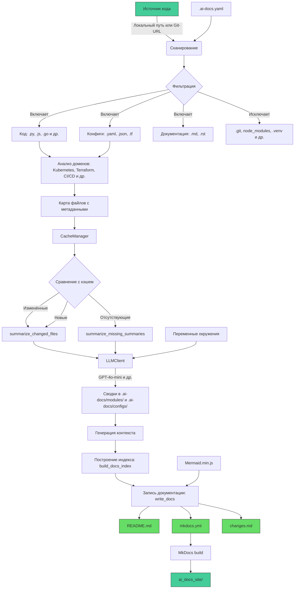

# Архитектура

# Архитектура

Архитектура `ai_docs` построена вокруг модульного, асинхронного и инкрементального подхода к генерации технической документации. Основной принцип — минимизация избыточной обработки за счёт кэширования и анализа изменений.

## Основные компоненты

### 1. **Сканирование (`scanner.py`)**
- Вход: локальный путь или URL Git-репозитория.
- Фильтрация по:
  - `.gitignore`, `.build_ignore`
  - `DEFAULT_EXCLUDE_PATTERNS` (`.venv`, `__pycache__`, `dist`)
  - `FIXED_INCLUDE_PATTERNS` (всегда включаемые файлы: `Dockerfile`, `*.tf`)
  - Пользовательские правила из `.ai-docs.yaml`
- Выход: `ScanResult` с метаданными файлов (путь, размер, тип, домен, первые 4000 символов).

### 2. **Классификация и анализ доменов**
- Определение инфраструктурных доменов по расширениям и именам файлов:
  - `TERRAFORM_EXTENSIONS`, `DOCKER_FILENAMES`, `CI_FILENAMES`
- Используется `classify_type` и `detect_domains` для аннотации файлов.

### 3. **Кэширование (`cache.py`, `CacheManager`)**
- Директория: `.ai_docs_cache/`
- Два уровня кэша:
  - `index.json` — хранит хэши, размеры и метаданные файлов для определения изменений.
  - `llm_cache.json` — кэш ответов LLM по хешу запроса.
- `diff_files` определяет: добавленные, изменённые, удалённые, неизменные файлы.
- `carry_unchanged_summaries` переносит существующие сводки, избегая повторной генерации.

### 4. **Генерация сводок (`summarize.py`)**
- Асинхронные функции:
  - `summarize_changed_files` — только для изменённых файлов.
  - `summarize_missing_summaries` — восстановление утерянных сводок.
- Использует семафор для ограничения параллельных запросов (`--threads`).
- Промпты:
  - `MODULE_SUMMARY_PROMPT` — для Doxygen-подобной документации.
  - `CONFIG_SUMMARY_PROMPT` — для конфигурационных файлов.
- Результат: Markdown-файлы в `.ai-docs/modules/` и `.ai-docs/configs/`.

### 5. **LLM-клиент (`llm.py`, `LLMClient`)**
- Асинхронный интерфейс через `AsyncOpenAI`.
- Поддержка OpenAI-совместимых API.
- Повторные попытки при ошибках 408, 429, 5xx.
- Динамический таймаут: `_compute_read_timeout` на основе размера входа.
- Кэширование по `sha256_text(payload)`.

### 6. **Построение документации (`docs.py`)**
- `build_docs_index` — формирует иерархический индекс на основе:
  - Наличия файлов в `docs/`
  - Доменов и типов из `file_map`
  - Приоритетов из `_index.json`
- `write_docs` — записывает файлы, добавляет Mermaid.js, очищает устаревшие.

### 7. **Генерация MkDocs (`mkdocs.py`)**
- `build_mkdocs_yaml` — создаёт `mkdocs.yml` с:
  - Навигацией по разделам: Архитектура, Модули, Конфиги
  - Поддержкой `mermaid2` плагина
  - Адаптацией под `local_site` режим
- Автоматический запуск `mkdocs build` в `ai_docs_site/`.
- Постобработка HTML: замена `&gt;` на `>` для корректного отображения Mermaid.

### 8. **Вспомогательные утилиты**
- `tokens.py` — токенизация через `tiktoken`, резервное побайтовое кодирование.
- `utils.py` — безопасное чтение файлов, проверка бинарных данных, нормализация путей.
- `context.py` — построение иерархического контекста с учётом лимита токенов.

## Поток данных

1. `main.py` — точка входа, парсинг CLI-аргументов.
2. `scan_source` — сканирование с фильтрацией.
3. `init_cache` → `diff_files` — определение изменений.
4. Параллельная генерация сводок через `LLMClient`.
5. Построение индекса и запись документации.
6. Генерация `mkdocs.yml` и сборка сайта.

## Особенности реализации

- **Инкрементальность**: перегенерируются только изменённые или отсутствующие сводки.
- **Пагинация**: при >100 модулей/конфигов — разбиение на страницы.
- **Мультиязычность**: поддержка `ru`/`en` через параметр `--language`.
- **Безопасность имён**: `write_summary` использует slug-идентификаторы.
- **Очистка**: `cleanup_orphan_summaries` удаляет неиспользуемые сводки.

Архитектура обеспечивает высокую производительность при повторных запусках и масштабируемость за счёт асинхронной обработки и чёткого разделения ответственности.
