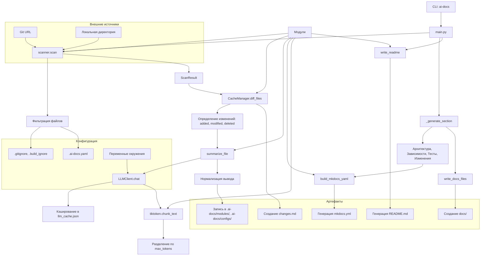

# Архитектура

# Архитектура

Архитектура `ai_docs` построена вокруг модульной обработки исходных файлов с последующей генерацией документации через LLM. Система разделена на этапы: сканирование, анализ, суммаризация, генерация и вывод. Все компоненты взаимодействуют через чётко определённые интерфейсы и данные в формате Python-объектов и JSON.

## Основные компоненты

### 1. CLI (`ai_docs/cli.py`)
Точка входа. Парсит аргументы командной строки, инициализирует окружение (`.env`), определяет режим работы (`--readme`, `--mkdocs`, `--local-site`) и запускает основной процесс в `main.py`.

### 2. Сканирование (`ai_docs/scanner.py`)
- **`scan()`** — рекурсивно обходит директорию или клонирует Git-репозиторий.
- Применяет фильтры:
  - Всегда включает: `Dockerfile`, `*.tf`, `requirements.txt`, `pyproject.toml`, `package.json`, `*.yaml` в инфраструктурных контекстах.
  - Исключает: `.git`, `__pycache__`, `node_modules`, `.venv`, `dist`, `build`, а также по `.gitignore` и `.build_ignore`.
- Поддерживает кастомные расширения через `.ai-docs.yaml`.
- Возвращает `ScanResult` — список файлов с путями, размерами, типами и доменами (Kubernetes, Terraform и др.).

### 3. Управление кэшем (`ai_docs/cache.py`)
- **`CacheManager`** — отслеживает состояние файлов через `index.json` (хэши SHA-256).
- Метод `diff_files()` возвращает:
  - `added`, `modified`, `deleted`, `unchanged`.
- Используется для инкрементальной обработки: пересоздаются только сводки по изменённым файлам.
- Отдельный `llm_cache.json` хранит ответы LLM по хешу payload.

### 4. LLM-клиент (`ai_docs/llm.py`)
- **`LLMClient`** — отправляет запросы к OpenAI-совместимому API.
- Поддерживает:
  - Кастомный `base_url` (например, для локальных моделей).
  - Кэширование через передачу `llm_cache` словаря.
  - Потокобезопасность при доступе к кэшу.
- Таймауты: 120 сек (connect), 480 сек (read).
- Параметры: `model`, `temperature`, `max_tokens`, `context_limit`.

### 5. Суммаризация (`ai_docs/summarize.py`)
- **`summarize_file()`** — основная функция.
- Определяет тип файла (код, конфиг, документация) и выбирает промпт:
  - `SUMMARY_PROMPT`, `MODULE_SUMMARY_PROMPT`, `CONFIG_SUMMARY_PROMPT`.
- Разбивает текст через `tiktoken.chunk_text()` при превышении `max_tokens`.
- Нормализует вывод: удаляет лишние заголовки, форматирует блоки конфигураций через ` `.
- Результат — Markdown-файл в `.ai-docs/modules/` или `.ai-docs/configs/`.

### 6. Генерация документации (`ai_docs/generate.py`)
- **`_generate_section()`** — генерирует разделы:
  - Архитектура (с Mermaid-диаграммами).
  - Зависимости (из `pyproject.toml`, `package.json`).
  - Тесты (на основе `test_`, `__tests__`).
  - Изменения (на основе `diff_files`).
- Использует LLM с кэшированием.
- Поддерживает локализацию через `SECTION_TITLES`, `DOMAIN_TITLES`.

### 7. MkDocs-интеграция (`ai_docs/mkdocs.py`)
- **`build_mkdocs_yaml()`** — формирует `mkdocs.yml`:
  - Включает `search`, `mermaid2`, `pymdownx`-расширения.
  - Настраивает `site_dir: docs`.
  - При `AI_DOCS_LOCAL_SITE` — отключает публикацию.
- **`_build_tree_nav()`** — строит древовидную навигацию из путей.
- **`write_docs_files()`** — копирует сгенерированные `.md` в `docs/`.

### 8. Вспомогательные модули
- **`utils.py`** — `ensure_dir`, `is_binary`, `safe_read`, `normalize_path`.
- **`tokenize.py`** — `count_tokens`, `chunk_text` через `tiktoken`.
- **`types.py`** — `CODE_EXTENSIONS`, `CONFIG_EXTENSIONS`, `detect_domains`.

## Поток данных

1. CLI → `main.py` → `scan()` → `ScanResult`.
2. `CacheManager.diff_files()` → определение изменённых файлов.
3. Для каждого изменённого файла → `summarize_file()` → `LLMClient.chat()` → кэширование → запись в `.ai-docs/`.
4. Генерация разделов → сборка `index.md`, `dependencies.md`, `changes.md`.
5. Построение `mkdocs.yml` и структуры `docs/`.
6. При необходимости — генерация `README.md`.

## Кэширование и производительность
- **Параллелизм**: `--threads` или `AI_DOCS_THREADS` (по умолчанию CPU-cores).
- **Кэш LLM**: повторные запросы с тем же payload не отправляются.
- **Кэш файлов**: неизменённые файлы не пересуммаризируются.
- **Ограничение контекста**: `chunk_text()` делит длинные файлы.

## Генерируемые артефакты
- `.ai-docs/` — промежуточные данные:
  - `_index.json` — навигационный индекс.
  - `modules/`, `configs/` — сводки по файлам.
  - `changes.md` — отчёт об изменениях.
- `.ai_docs_cache/` — `index.json`, `llm_cache.json`.
- `README.md` — краткая документация.
- `docs/` — полный сайт (MkDocs).
- `mkdocs.yml` — конфигурация сайта.

Архитектура обеспечивает масштабируемость, повторяемость и минимальное время перегенерации за счёт инкрементального подхода и кэширования.
