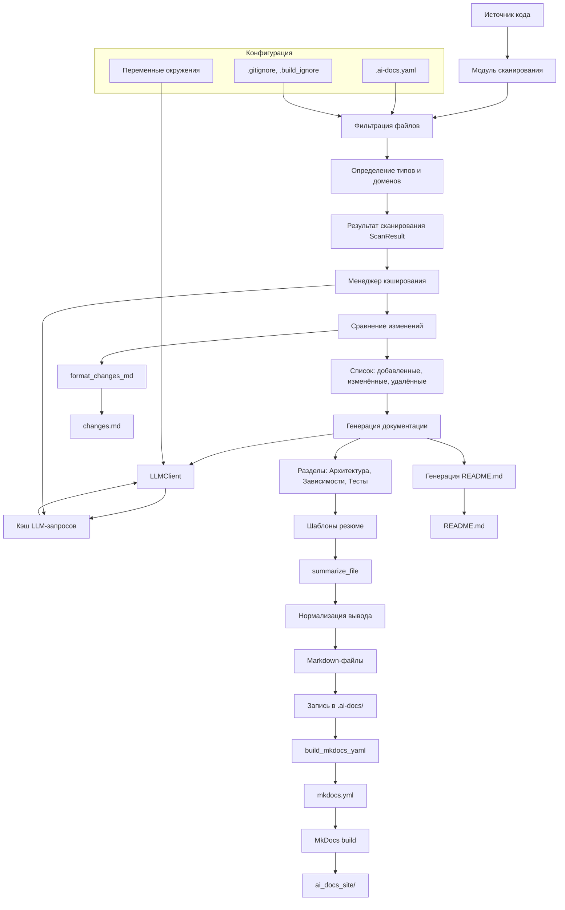

# Архитектура

## Архитектура

Система `ai_docs` построена по модульному принципу, где каждый компонент отвечает за определённый этап обработки исходного кода и генерации документации. Архитектура ориентирована на производительность, повторную обработку и поддержку различных типов проектов.

### Основные компоненты

#### 1. **Модуль сканирования (`scanner`)**
- Отвечает за рекурсивный обход файловой системы или клонирование Git-репозитория.
- Применяет фильтрацию по:
  - `.gitignore`, `.build_ignore`;
  - кастомным правилам из `.ai-docs.yaml`;
  - встроенным шаблонам (`node_modules`, `.venv`, `__pycache__` и др.).
- Определяет тип файла (код, конфигурация, документация) и домен (Terraform, Docker, Kubernetes) по расширениям и именам.
- Возвращает объект `ScanResult` с полным списком файлов, их метаданными и хешами.

#### 2. **Менеджер кэширования (`cache`)**
- Управляет двумя JSON-файлами:
  - `index.json` — хранит хеши и метаданные файлов для отслеживания изменений;
  - `llm_cache.json` — кэширует ответы LLM по хешу запроса.
- Метод `diff_files` возвращает четыре категории файлов: добавленные, изменённые, удалённые, неизменённые.
- Используется для инкрементальной обработки: перегенерируются только изменившиеся или новые файлы.

#### 3. **LLM-клиент (`llm_client`)**
- Выполняет запросы к OpenAI-совместимому API.
- Поддерживает кастомные `base_url`, что позволяет использовать локальные модели (например, через Ollama).
- Параметры: `model`, `temperature`, `max_tokens`, `context_limit`.
- Кэширование на основе SHA256 от сериализованного payload.
- Потокобезопасен: использует `threading.Lock` при доступе к кэшу.

#### 4. **Генератор документации (`main`, `summary`)**
- Основная логика в `generate_docs`.
- Для каждого файла вызывается `summarize_file`, который:
  - Читает содержимое;
  - Разбивает на чанки при превышении `max_tokens` (через `chunk_text`);
  - Отправляет промпты в LLM (в зависимости от типа: `SUMMARY_PROMPT`, `MODULE_SUMMARY_PROMPT`, `CONFIG_SUMMARY_PROMPT`);
  - Нормализует вывод (`_normalize_module_summary`, `_format_config_blocks`).
- Результат сохраняется в `.ai-docs/modules/` или `.ai-docs/configs/`.

#### 5. **Построение структуры документации**
- `build_mkdocs_yaml` формирует `mkdocs.yml` с:
  - Поддержкой `mermaid2`, `pymdown-extensions`;
  - Динамической навигацией через `_build_tree_nav`;
  - Условной настройкой `use_directory_urls` для локального запуска (`AI_DOCS_LOCAL_SITE`).
- `write_docs_files` записывает все Markdown-файлы, создавая необходимые поддиректории.

#### 6. **Генерация README.md**
- Формируется на основе ключевых разделов: архитектура, зависимости, тесты, изменения.
- Использует LLM для краткого описания проекта.
- Перезаписывается только при флаге `--force`.

#### 7. **Отчёт об изменениях**
- `format_changes_md` генерирует `changes.md` с перечнем:
  - Добавленных/изменённых/удалённых файлов;
  - Перегенерированных разделов;
  - Итогового резюме изменений.

### Поток данных

1. **Ввод**: `--source` (путь или URL).
2. **Сканирование**: фильтрация, классификация, хеширование.
3. **Сравнение с кэшом**: определение изменённых файлов.
4. **Генерация**:
   - Параллельная обработка через `--threads`;
   - Кэшированные LLM-запросы;
   - Нормализация и запись в `.ai-docs/`.
5. **Построение**:
   - Формирование `mkdocs.yml`;
   - Генерация `README.md`.
6. **Вывод**: `ai_docs_site/`, `README.md`, `changes.md`.

### Особенности реализации

- **Безопасность имён**: пути в `.ai-docs/` нормализуются через `slugify`.
- **Обработка бинарных файлов**: пропускаются, если содержат нулевые байты.
- **Поддержка локализации**: заголовки разделов (`SECTION_TITLES`) зависят от `--language`.
- **Очистка устаревших файлов**: при изменении структуры удаляются неактуальные `.md` в `docs/`.

Архитектура обеспечивает масштабируемость, повторяемость и минимальное время повторной генерации за счёт точечного обновления и кэширования.
