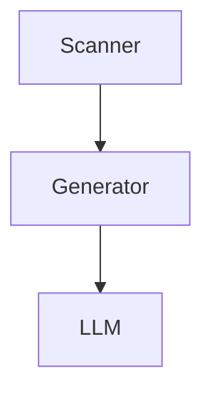

# Integrations

## LLM Integration

### OpenAI Client (`ai_docs/llm.py`)

**Endpoint Configuration**:
```bash
OPENAI_API_KEY=<key>
OPENAI_BASE_URL=<optional custom endpoint>
OPENAI_MODEL=gpt-4o-mini  # default
```

**Client Features**:
- Async calls via `AsyncOpenAI`
- Token estimation (`tiktoken`)
- Adaptive timeout (60-1200s based on input size)
- Retry with exponential backoff (max 5 attempts)
- Response caching (SHA256 key)

**Retry Logic**:
| Status | Behavior |
|--------|----------|
| 408, timeout | Increase timeout 1.5x, retry |
| 429, 5xx | Backoff 1s → 60s (doubling), retry |
| Other | Fail immediately |

**Cache Key**:
```python
payload = {"model": ..., "messages": ..., "temperature": ..., "max_tokens": ...}
key = sha256_text(json.dumps(payload, sort_keys=True))
```

## MkDocs Integration (`ai_docs/mkdocs.py`)

**Generated Config**:
```yaml
site_name: ai-docs
docs_dir: .ai-docs
site_dir: ai_docs_site
plugins:
- search
- mermaid2:
    javascript: js/mermaid.min.js
markdown_extensions:
- tables
- sane_lists
- attr_list
- def_list
- footnotes
- admonition
- fenced_code
- pymdownx.superfences:
    custom_fences:
    - name: mermaid
      class: mermaid
      format: !!python/name:mermaid2.fence_mermaid
```

**Navigation Structure**:
- Главная → index.md
- Обзор → overview.md
- Архитектура → architecture.md
- Запуск → runtime.md
- Зависимости → dependencies.md
- Тестирование → testing.md
- Соглашения → conventions.md
- Глоссарий → glossary.md
- Конфигурация проекта → configs/*.md
- Модули → modules/*.md
- Изменения → changes.md

**Local Site Mode** (`--local-site`):
```yaml
site_url: ""
use_directory_urls: false
```

## Mermaid Diagrams

**Asset**: `ai_docs/assets/mermaid.min.js` (v9.x, bundled)

**Usage in Markdown**:
````markdown

````

**Render**: через `mkdocs-mermaid2-plugin`

## File System Integration

### Cache Directory (`.ai_docs_cache/`)
```
.ai_docs_cache/
├── index.json          # Snapshot файлов и секций
├── llm_cache.json      # LLM response cache
└── intermediate/
    ├── files/          # Per-file summaries
    ├── modules/        # Module-level summaries
    └── configs/        # Config summaries
```

### Output Directory Structure
```
<output_root>/
├── README.md
├── mkdocs.yml
├── .ai-docs/           # Generated markdown sources
│   ├── architecture.md
│   ├── runtime.md
│   ├── changes.md
│   ├── index.md
│   ├── modules/
│   └── configs/
└── ai_docs_site/       # Built HTML site
    ├── index.html
    ├── architecture.html
    └── ...
```

## Environment Integration

### `.env` File Support
```bash
OPENAI_API_KEY=sk-...
OPENAI_BASE_URL=https://api.openai.com/v1
OPENAI_MODEL=gpt-4o-mini
OPENAI_TEMPERATURE=0.2
OPENAI_MAX_TOKENS=1200
OPENAI_CONTEXT_TOKENS=8192
AI_DOCS_THREADS=4
AI_DOCS_LOCAL_SITE=false
AI_DOCS_REGEN=architecture,changes
```

Загрузка через `python-dotenv` в `cli.main()`.

### Shell Script Integration (`run_docs_bg.sh`)

**Features**:
- Background execution с `setsid`/`nohup`
- PID tracking (`run.pid`)
- Log rotation (`logs/ai-docs-YYYYMMDD-HHMMSS.log`)
- Status check (elapsed time, tail logs)

**Usage**:
```bash
./run_docs_bg.sh /path/to/project --readme --mkdocs
```

## Git Integration

### Repository Scanning
```python
scan_source("https://github.com/org/repo")  # clone --depth 1
scan_source("./local/path")
```

**Ignore Patterns**:
- `.gitignore` — через `pathspec`
- `.build_ignore` — дополнительные исключения
- Default excludes: `.venv`, `node_modules`, `dist`, `.git`

### Config File (`.ai-docs.yaml`)
```yaml
code_extensions:
  .py: Python
  .ts: TypeScript
doc_extensions:
  .md: Markdown
config_extensions:
  .yml: YAML
  .toml: TOML
exclude:
  - "logs/*"
  - "**/*.log"
```

## Domain Detection

**Infra Domains** (`ai_docs/domain.py`):
| Domain | Detection Patterns |
|--------|-------------------|
| `kubernetes` | `deployment.yaml`, `apiVersion` + `kind` in YAML |
| `helm` | `Chart.yaml`, `values.yaml`, `charts/` |
| `terraform` | `.tf`, `.tfvars` |
| `ansible` | `roles/`, `tasks/` |
| `docker` | `Dockerfile*`, `docker-compose.yml` |
| `ci` | `.gitlab-ci.yml`, `Jenkinsfile`, `.github/workflows/` |
| `observability` | `prometheus.yml`, `grafana/`, `otel/` |
| `service_mesh` | `istio/`, `linkerd/`, `VirtualService` |
| `data_storage` | `postgres/`, `redis/`, `kafka/`, `mongodb/` |

## CLI Integration

**Entry Point**: `ai-docs` (через `project.scripts`)

**Commands**:
```bash
ai-docs --source ./project --readme --mkdocs
ai-docs --source https://github.com/org/repo --language en
ai-docs --source ./project --regen architecture,changes --threads 4
ai-docs --source ./project --no-cache --force
```

**Arguments**:
| Argument | Purpose |
|----------|---------|
| `--source` | Local path or git URL |
| `--output` | Output directory (default: source for local) |
| `--readme` | Generate README.md |
| `--mkdocs` | Generate MkDocs site |
| `--language` | ru (default) / en |
| `--include` | Include patterns (glob) |
| `--exclude` | Exclude patterns (glob) |
| `--max-size` | Max file size (default: 200KB) |
| `--cache-dir` | Cache directory (default: `.ai_docs_cache`) |
| `--no-cache` | Disable LLM cache |
| `--threads` | Parallel workers |
| `--local-site` | MkDocs local mode |
| `--force` | Overwrite existing README |
| `--regen` | Force regen sections |
